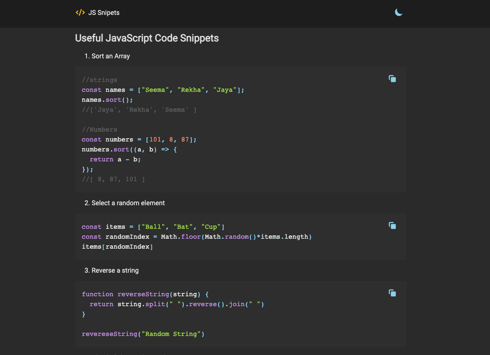

This project was bootstrapped with [Create React App](https://github.com/facebook/create-react-app).

## Available Scripts

In the project directory, you can run:

### `yarn install`

Instal All dependencies in this project

### `yarn dev`

Runs the app in the development mode. 
Open [http://localhost:3000](http://localhost:3000) to view it in the browser.

### Deploy

- npm run deploy

### Run blog index script

- Add "type": "module" in package.json file
- run npm run run-script

### Video Tutorial

You can see my youtube video for this project in [here](https://youtu.be/Od-Uj5RSsuM)